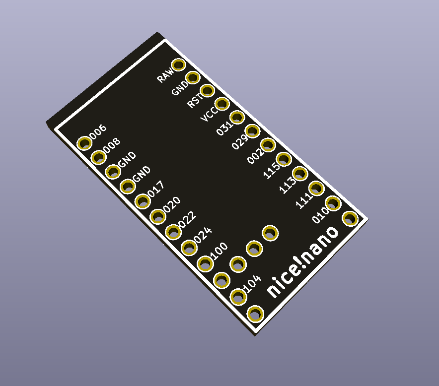

Unofficial symbol and footprint for the nice!nano

https://nicekeyboards.com/nice-nano

The nice!nano is compatible with the elite-C (see https://deskthority.net/wiki/Elite-C for pinout), and the pro micro. The side pins will be on the same positions.

If you want pro-micro compatibility:

* Use pins RAW (positive) and GND (negative) for battery charging, don't use pins 101, 102, 107

If you want elite-C compatibility:

* Pins 101, 102, 107 should be connected to pins B7, D5, C7, F1, F0 (choose which ones).
* Pins RAW (positive) and GND (negative) should be used for battery charging

## License

This work is licensed under the GNU GPLv3.
